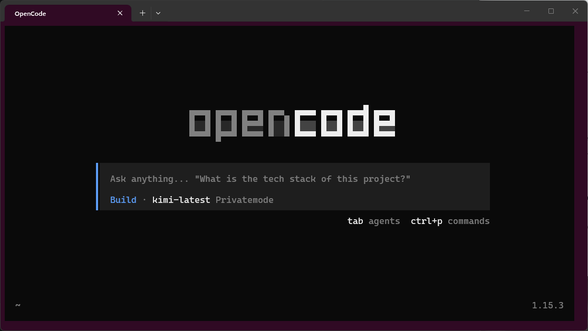
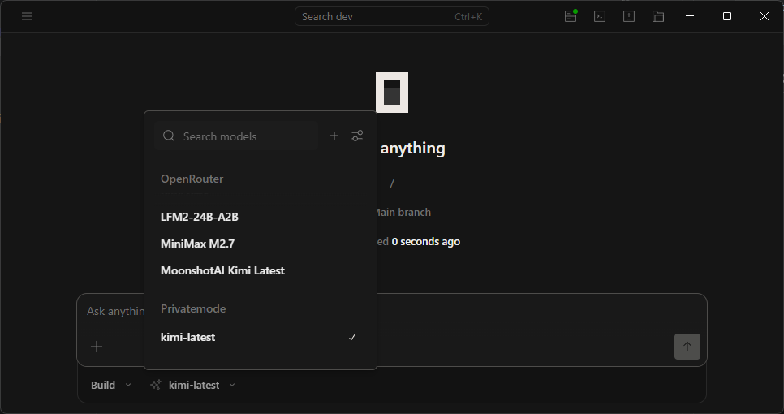

# Open Code with privatemode.ai

It is very easy to run Open Code with privatemode.ai. You can run it in WSL or directly on Windows Desktop. In both cases, you just need to ensure the Privatemode Proxy is running and properly configured in Open Code. 

After that, all AI inference traffic from Open Code will be securely routed through Privatemode Proxy, providing end-to-end encryption and isolation in a trusted execution environment. So at no point does your data get exposesd to anyone including the model provider.

## WSL

> Just type `oc` in your terminal to start the proxy and launch Open Code. Make sure to set your API key in `~/.config/opencode/run-pm.sh` before running. Go to <https://portal.privatemode.ai/> to create one.



### Installation

1. Install Docker Desktop for Windows and enable WSL integration.
2. Install Open Code by following the instructions at <https://opencode.ai/download> or just `curl -fsSL https://opencode.ai/install | bash`.
3. Get your Privatemode API key from <https://portal.privatemode.ai/> and set it in `~/.config/opencode/run-pm.sh`.
4. Set up the `oc` helper function in your shell profile (e.g. `~/.bashrc` or `~/.zshrc`) to start the Privatemode Proxy and then launch Open Code.


### Profile

Path: ~/.bashrc

```bash
# opencode helper: start proxy, then launch opencode
oc() {
    bash ~/.config/opencode/run-pm.sh || true
    opencode "$@"
}
```

### Script to ensure Privatemode Proxy is running before launching Open Code

> Set the `API_KEY` variable in `~/.config/opencode/run-pm.sh` to your Privatemode API key.

- Path: ~/.config/opencode/run-pm.sh
- Content: [run-pm.sh](./run-pm.sh)

### Configuration in Open Code

> In this configuration, we use port 8080 for the Privatemode Proxy, and set the base URL to `http://localhost:8080/v1`. Make sure this matches the port used in `run-pm.sh`. Change it if you use a different port.

- Path: ~/.config/opencode/opencode.json

```json
{
  "$schema": "https://opencode.ai/config.json",
  "provider": {
    "privatemode": {
      "npm": "@ai-sdk/openai-compatible",
      "name": "Privatemode",
      "options": {
        "baseURL": "http://localhost:8080/v1"
      },
      "models": {
        "kimi-latest": {
          "name": "kimi-latest"
        }
      }
    }
  },
  "model": "privatemode/kimi-latest"
}
```

## Windows Desktop

> Ensure the docker container for the Privatemode Proxy is running on port 8080.



### Configuration in Open Code

> In this configuration, we use port 8080 for the Privatemode Proxy, and set the base URL to `http://localhost:8080/v1`. Make sure this matches the port used in `run-pm.sh`. Change it if you use a different port.

- Path: ~/.config/opencode/opencode.json

```json
{
  "$schema": "https://opencode.ai/config.json",
  "provider": {
    "privatemode": {
      "npm": "@ai-sdk/openai-compatible",
      "name": "Privatemode",
      "options": {
        "baseURL": "http://localhost:8080/v1"
      },
      "models": {
        "kimi-latest": {
          "name": "kimi-latest"
        }
      }
    }
  },
  "model": "privatemode/kimi-latest"
}
```