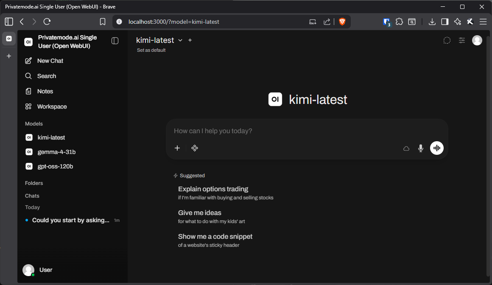

# Open WebUI Single User Setup

This setup provides a secure, single-user instance of Open WebUI, integrated with Privatemode Proxy for end-to-end encrypted AI inference. It is designed for local use, with optional Speech-to-Text (STT) support and a built-in Open Terminal for code execution and automation.

All AI inference traffic is routed through Privatemode Proxy, and is securely encrypted end-to-end and isolated in a trusted execution environment. So at no point does your data get exposesd to anyone including the model provider.

> Set the API key in `docker-compose/.env`, go to <https://portal.privatemode.ai/> to create one.
> And then just run: `./start.ps1` and open [http://localhost:3000/?model=kimi-latest](http://localhost:3000/?model=kimi-latest) to get started.



---

**Note on Network Isolation:**

Currently, it is not possible to run Open WebUI in a fully network-isolated manner. Setting the following in your `docker-compose.yml`:

```yaml
  app-internal:
    internal: true
```

will not work yet with Open WebUI. This feature may be supported hopefully in the future.

---

## Features

- **End-to-end encrypted AI inference** via Privatemode Proxy
- **Open WebUI**: Local chat UI with model selection
- **Speech-to-Text (STT)**: Route OpenAI-compatible STT through Privatemode Proxy
- **Open Terminal**: Secure, isolated shell access for code execution
- **Offline mode**: No Hugging Face or internet downloads required (except Privatemode API)

---

## Quick Start

1. Clone this repository and navigate to the `open-webui-single-user` directory.
2. Copy `docker-compose/sample.env` to `docker-compose/.env` and set your Privatemode API key.
3. Start the stack:

   ```powershell
   ./start.ps1
   ```

4. Open [http://localhost:3000/?model=kimi-latest](http://localhost:3000/?model=kimi-latest) in your browser.

---

## Speech-to-Text via Privatemode Proxy (Optional)

To route Open WebUI's Speech-to-Text traffic through `privatemode-proxy`, add these environment variables to the `open-webui` service in `docker-compose/docker-compose.yml`:

```yaml
AUDIO_STT_ENGINE: openai
AUDIO_STT_MODEL: whisper-large-v3
AUDIO_STT_OPENAI_API_BASE_URL: http://privatemode-proxy:8080/v1
AUDIO_STT_OPENAI_API_KEY: ${PM_API_KEY}
```

These should be placed alongside `OPENAI_API_BASE_URL` and `OPENAI_API_KEY` so both chat completions and STT use the same proxy endpoint.

Reference: [Open WebUI Speech-to-Text OpenAI](https://docs.openwebui.com/reference/env-configuration/#speech-to-text-openai)

---

## Supported Models

> <https://docs.privatemode.ai/models/overview/>

| Model                                                                                                    | Model ID                   | Type           | Input       | Context / limit | Endpoints                                                 |
| -------------------------------------------------------------------------------------------------------- | -------------------------- | -------------- | ----------- | --------------- | --------------------------------------------------------- |
| [Gemma 3 27B](https://huggingface.co/leon-se/gemma-3-27b-it-FP8-Dynamic) *(deprecated)*                  | `gemma-3-27b`              | Chat           | Text, image | 128k tokens     | `/v1/chat/completions`                                    |
| [Gemma 4 31B](https://huggingface.co/nvidia/Gemma-4-31B-IT-NVFP4)                                        | `gemma-4-31b`              | Chat           | Text, image | 256k tokens     | `/v1/chat/completions`, `/v1/completions`, `/v1/messages` |
| [gpt-oss-120b](https://huggingface.co/openai/gpt-oss-120b)                                               | `gpt-oss-120b`             | Chat           | Text        | 128k tokens     | `/v1/chat/completions`, `/v1/completions`, `/v1/messages` |
| [Kimi K2.6](https://huggingface.co/moonshotai/Kimi-K2.6)                                                 | `kimi-k2.6`, `kimi-latest` | Chat           | Text, image | 256k tokens     | `/v1/chat/completions`, `/v1/completions`, `/v1/messages` |
| [Qwen3-Coder 30B-A3B](https://huggingface.co/stelterlab/Qwen3-Coder-30B-A3B-Instruct-AWQ) *(deprecated)* | `qwen3-coder-30b-a3b`      | Chat           | Text        | 128k tokens     | `/v1/chat/completions`, `/v1/completions`                 |
| [Qwen3-Embedding 4B](https://huggingface.co/boboliu/Qwen3-Embedding-4B-W4A16-G128)                       | `qwen3-embedding-4b`       | Embedding      | Text        | 32k tokens      | `/v1/embeddings`                                          |
| [Voxtral Mini 3B](https://huggingface.co/mistralai/Voxtral-Mini-3B-2507)                                 | `voxtral-mini-3b`          | Speech-to-text | Audio       | 50 MB           | `/v1/audio/transcriptions`                                |
| [Whisper large-v3](https://huggingface.co/openai/whisper-large-v3)                                       | `whisper-large-v3`         | Speech-to-text | Audio       | 50 MB           | `/v1/audio/transcriptions`                                |

---

## Inspect Network Traffic

To inspect container network traffic (for debugging):

```powershell
docker run --rm -it `
  --net=container:docker-compose-open-webui-1 `
  --cap-add=NET_ADMIN --cap-add=NET_RAW `
  nicolaka/netshoot `
  tcpdump -n -i eth0
```

---

## Open Terminal


## Open Terminal Network Access

By default, the `open-terminal` service has network access. You can restrict this by uncommenting the `internal: true` line under the `webui-terminal` network in your `docker-compose.yml`:

```yaml
  webui-terminal:
    internal: true
```

This will prevent `open-terminal` from accessing the external network.

---

Open Terminal provides a real computing environment to Open WebUI. The AI can write and execute code, read output, fix errors, and iterate—all within the chat interface. It handles files, installs packages, runs servers, and returns results directly to you. Run it in a Docker container for isolation, or on bare metal for direct access to your machine.

Learn more: [Open Terminal Documentation](https://docs.openwebui.com/features/open-terminal/)